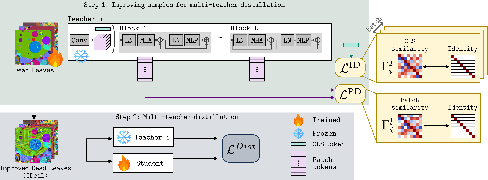

<div align="center">
<h1> IDeaL: Data-Free Multi-Teacher Distillation via Improved Dead Leaves </h1>


**Feyza Yavuz**, [**Mert Bulent Sariyildiz**](https://mbsariyildiz.github.io/), [**Diane Larlus**](https://europe.naverlabs.com/people_user_naverlabs/diane-larlus/)

NAVER LABS Europe

**ECCV 2026**

[[Paper](https://arxiv.org/abs/XXXX.XXXXX)] · [[Citation](#citation)] · [[Code for UNIC (for Step 2 and evaluation)](https://github.com/naver/unic)]
</div>

## Contents

- [About IDeaL](#about-ideal)
- [Installation](#installation)
- [Step 1: Generating IDeaL samples](#step-1-generating-ideal-samples)
- [Step 2: Distillation](#step-2-distillation) ([UNIC](https://github.com/naver/unic))
- [Evaluation](#evaluation) ([UNIC](https://github.com/naver/unic))
- [Main results](#main-results)
- [Citation](#citation)
- [Acknowledgements](#acknowledgements)
- [License](#license)

---

### About IDeaL

Multi-teacher distillation combines complementary teacher models into a student that exhibits the strengths of all its teachers. Typically, this requires large amounts of real images. In this paper, we question that assumption and explore alternative options. We first study how far one can go when distilling from teachers fed with different types of noise. Then, we show that information contained in the teachers can be leveraged to tailor the noise for multi-teacher distillation: we propose a method that, thanks to decorrelation losses at both patch and image levels, generates teacher-specific, improved samples optimized for data-free distillation. Our most effective samples, **IDeaL**, lead to strong students that successfully capture complementary information from the teachers, yielding surprisingly competitive results that substantially narrow the gap with students distilled from real images.


<p align="center">
  
</p>
<p align="center"><em>IDeaL pipeline. Starting from structured noise (e.g. Dead Leaves), pixel values are optimized by backpropagating decorrelation losses through frozen ViT teachers. The resulting images are then used as training data for multi-teacher distillation via UNIC.</em></p>

### Method overview

**Step 1: Sample generation.** Given an initial noise image (e.g. a Dead Leaves sample or Gaussian noise), IDeaL treats its pixel values as learnable parameters and iteratively updates them by minimizing a generation loss, backpropagating through a set of frozen teacher encoders. The key insight is that the teachers' internal representations contain rich information that can be exploited to make synthetic images more useful for distillation, without ever seeing real data.

The generation loss combines three terms:

```math
\mathcal{L}_G = \alpha_1 \mathcal{L}_{TV} + \sum_{i=1}^{n} \left( \alpha_2 \mathcal{L}^{PD}_i + \alpha_3 \mathcal{L}^{ID}_i \right)
```

where:
- **Patch decorrelation loss**: encourages diverse patch representations within each image by minimizing off-diagonal cosine similarities between patch features across all transformer layers of each teacher:

```math
\mathcal{L}^{PD}_i = \frac{1}{P^2} \sum_{\ell=1}^{L} \lVert \Gamma^{\ell}_i - I_P \rVert_F^2
```

- **Image decorrelation loss**: prevents mode collapse across generated samples by minimizing pairwise cosine similarities between global image representations:

```math
\mathcal{L}^{ID}_i = \frac{1}{B^2} \lVert \Gamma^{I}_i - I_B \rVert_F^2
```

- **Total variation loss**: regularizes pixel smoothness.

By summing over all teachers, generated images are optimized to be jointly informative across all teachers' feature spaces. The method requires no labels, no classification heads, and no access to the teachers' training data, only forward passes through frozen encoders.

**Step 2: Multi-teacher distillation ([UNIC](https://github.com/naver/unic)).** Once the synthetic dataset is generated, a student encoder is trained via multi-teacher distillation using the [UNIC](https://github.com/naver/unic) framework. The student is trained to mimic the output of all teachers simultaneously on the IDeaL images, inheriting complementary knowledge from each teacher into a single model. The two stages are fully decoupled: the synthetic dataset is generated once and can be reused across different student architectures or distillation configurations.


## Installation
### Requirements

Create a conda environment (tested with Python 3.10, PyTorch 2.5.1, CUDA 12.4) and install the dependencies:

```bash
conda create -n ideal python=3.10
conda activate ideal
pip install -r requirements.txt
```

### Teacher models

We use four ViT-B/16 teachers, all pretrained on ImageNet-1K, the same teachers as [UNIC](https://github.com/naver/unic). See its [teacher-preparation scripts](https://github.com/naver/unic/tree/main/scripts/teachers) to download them.

| Teacher | Architecture | Source |
|---|---|---|
| DINO | ViT-B/16 | [facebookresearch/dino](https://github.com/facebookresearch/dino) |
| iBOT | ViT-B/16 | [bytedance/ibot](https://github.com/bytedance/ibot) |
| DeiT-III | ViT-B/16 | [facebookresearch/deit](https://github.com/facebookresearch/deit) |
| dBOT-ft | ViT-B/16 | [liuxingbin/dbot](https://github.com/liuxingbin/dbot) |

Once downloaded, place the checkpoints as:

```
checkpoints/
├── dino_vitbase_16.pth
├── deit3_vitbase_16.pth
├── ibot_vitbase_16.pth
└── dbotft_vitbase_16.pth
```

or set the `IDEAL_CHECKPOINT_DIR` environment variable to their location.

### Initial samples

The pixel optimization starts from Dead Leaves samples (`dead_leaves-mixed`), from [mbaradad/learning_with_noise](https://github.com/mbaradad/learning_with_noise) (Baradad et al., NeurIPS 2021).

Alternatively, use `--dataset_type noise` to initialize from Gaussian noise (generated on the fly, no download needed).


## Step 1: Generating IDeaL samples

We provide generated IDeaL samples ready for distillation: [Download](https://download.europe.naverlabs.com/ComputerVision/ideal/ideal_dead_leaves_dataset.zip). If you want to generate your own samples, follow the instructions below.

Use `generate_ideal.py` to produce optimized training images. The default arguments reproduce the paper protocol (Sec. 5.1):
pools of 250 seeds, random subsets of 40 re-drawn every 10 iterations, 4000 optimization iterations, Adam with lr 0.1, and loss weights (α<sub>tv</sub>, α<sub>pd</sub>, α<sub>id</sub>) = (0.05, 1, 1).

```bash
python generate_ideal.py \
    --dataset_path /path/to/dead_leaves_images \
    --num_images 1000 \
    --output_dir ./outputs/ideal_1k
```

Optimized images are saved to `<output_dir>/images/` as individual PNGs. 
**Key arguments:**

| Argument | Default | Description |
|---|---|---|
| `--dataset_path` | (required) | Path to seed images directory or `.pkl` file |
| `--dataset_type` | `dead_leaves` | Seed type: `dead_leaves` or `noise` |
| `--num_images` | `1000` | Total images to generate |
| `--output_dir` | (required) | Output directory |
| `--teachers` | all four | Comma-separated teacher names |
| `--iterations` | `4000` | Optimization iterations per pool |
| `--pool_size` | `250` | Seed images per pool |
| `--subset_size` | `40` | Subset optimized each iteration |
| `--lr` | `0.1` | Adam learning rate |
| `--alpha_tv` | `0.05` | TV loss weight |
| `--alpha_pd` | `1.0` | Patch decorrelation weight |
| `--alpha_id` | `1.0` | Image decorrelation weight |


## Step 2: Multi-Teacher Distillation

Once the IDeaL images are generated, a student ViT encoder is trained via multi-teacher distillation using the [UNIC](https://github.com/naver/unic) framework. The student is trained so that its features (patch-level and CLS token) match every teacher's representations simultaneously, by minimizing a distillation loss that sums over teacher-specific losses.
Each teacher-specific loss aligns the student's CLS and patch features with the corresponding teacher's outputs. The IDeaL images are used exactly as if they were real data.

We trained our models on 4 GPUs. The default batch size is 128 per GPU. Use the [UNIC](https://github.com/naver/unic) training script `main_unic.py`, with the IDeaL images generated in Step 1:

```bash
# In the UNIC repository
source ./scripts/setup_env.sh

torchrun --rdzv-backend=c10d --rdzv-endpoint=localhost:0 \
    --nnodes=1 --nproc_per_node=${N_GPUS} main_unic.py \
    --data_dir=./outputs/ideal_1k/images \
    --output_dir=/path/to/student_checkpoint \
    --seed=${RANDOM}
```

Note: `--data_dir` should point to the same `<output_dir>/images/` directory produced by `generate_ideal.py` in Step 1. The student architecture is a ViT-B/16. See the [UNIC training instructions](https://github.com/naver/unic#training-unic-models) for additional options.

### Using the released IDeaL dataset with UNIC

If you use the **released IDeaL dataset** (instead of generating your own in Step 1), it is organized as:

```
ideal_dead_leaves_dataset/
├── train/
│   ├── images_part_001/   # 10,000 PNGs each: image_00000000.png … image_00009999.png
│   │   …
│   └── images_part_100/   # 100 folders × 10,000 = 1,000,000 images
└── metadata/
    ├── ideal_dead_leaves_1k.pkl     #     1,000 samples
    ├── ideal_dead_leaves_10k.pkl    #    10,000 samples
    ├── ideal_dead_leaves_100k.pkl   #   100,000 samples
    └── ideal_dead_leaves_1m.pkl     # 1,000,000 samples (the full pool)
```

The 1K / 10K / 100K subsets are strict subsets of the 1M pool.

**Full 1M pool** UNIC's `main_unic.py` loads training data with `ImageFolder(os.path.join(data_dir, "train"))`, so just point `--data_dir` at the dataset root. The `images_part_XXX` folders act as pseudo-classes; labels are irrelevant to UNIC (it distills from teacher features).

```bash
# In the UNIC repository
torchrun --rdzv-backend=c10d --rdzv-endpoint=localhost:0 \
    --nnodes=1 --nproc_per_node=${N_GPUS} main_unic.py \
    --data_dir=/path/to/ideal_dead_leaves_dataset \
    --output_dir=/path/to/student_checkpoint \
    --seed=${RANDOM}
```

**1K / 10K / 100K subsets.** `main_unic.py` has no `.pkl` loader, so to train on a subset, add a small dataset that reads the metadata list and use it in place of `ImageFolder` in `get_dataloaders`:

```python
import os, pickle
from torch.utils.data import Dataset
from torchvision.datasets.folder import default_loader

class PklImageList(Dataset):
    def __init__(self, root, pkl, transform=None):
        self.root = root
        self.samples = pickle.load(open(pkl, "rb"))  # list of (relative_path, label)
        self.transform = transform
        self.loader = default_loader
    def __len__(self):
        return len(self.samples)
    def __getitem__(self, i):
        rel, target = self.samples[i]
        img = self.loader(os.path.join(self.root, rel))
        if self.transform is not None:
            img = self.transform(img)
        return img, target

# in get_dataloaders(), replace the train ImageFolder with e.g.:
# train_dataset = PklImageList(
#     args.data_dir,
#     os.path.join(args.data_dir, "metadata/ideal_dead_leaves_100k.pkl"),
#     transform=...,  # keep the same train transforms
# )
```

Each `.pkl` is a Python `list` of `(relative_image_path, label)` tuples, with paths relative to the dataset root and label always `0`.


## Evaluation

We evaluate the distilled student on four downstream tasks, following the [UNIC evaluation protocol](https://github.com/naver/unic#evaluating-unic-models). All evaluation scripts are part of the [UNIC repository](https://github.com/naver/unic).

### Transfer learning

We evaluate on 15 classification datasets (including ImageNet-1K, fine-grained, and long-tail benchmarks) by extracting frozen features and training logistic regression classifiers on top. See the [list of supported datasets](https://github.com/naver/unic/blob/main/eval_transfer/main_ft_extract.py) in UNIC's `eval_transfer/`.

```bash
# Extract features from the student
python eval_transfer/main_ft_extract.py \
    --pretrained=/path/to/student_checkpoint/checkpoint.pth \
    --dataset=in1k \
    --image_size=224 \
    --output_dir=/path/to/features

# Train logistic regression classifier
# For large datasets (in1k, cog_*, inat*), use l2 normalization and logreg_torch.
# For smaller datasets (aircraft, cars196, dtd, etc.), use --features_norm=none --clf_type=logreg_sklearn.
python -m sklearnex eval_transfer/main_clf.py \
    --features_dir=/path/to/features \
    --features_norm=l2 \
    --clf_type=logreg_torch
```

### Semantic segmentation

We follow the [DINOv2](https://github.com/facebookresearch/dinov2) linear probing protocol for semantic segmentation on [ADE20K](http://sceneparsing.csail.mit.edu/). This requires additional packages with specific versions:

```bash
pip install openmim
mim install "mmcv-full==1.7.2"
mim install "mmengine==0.10.1"
pip install "mmsegmentation==0.30.0"
pip install ftfy
```

If you encounter any mismatch between package versions, we recommend creating a new conda environment as mentioned in the [DINOv2 repository](https://github.com/facebookresearch/dinov2?tab=readme-ov-file#installation).

```bash
python eval_dense/eval_semseg.py \
    --data_dir=/path/to/ADEChallengeData2016 \
    --pretrained=/path/to/student_checkpoint/checkpoint.pth
```

### Depth estimation

We evaluate depth estimation on [NYU Depth V2](https://cs.nyu.edu/~fergus/datasets/nyu_depth_v2.html) using a linear probe on frozen features, following UNIC's `eval_dense/eval_depth.py`.

```bash
python eval_dense/eval_depth.py \
    --pretrained=/path/to/student_checkpoint/checkpoint.pth
```

Note: the dataset path is configured inside `eval_depth.py` — update it to point to your local copy of NYU Depth V2.

For further details on all tasks, see the [UNIC evaluation instructions](https://github.com/naver/unic#evaluating-unic-models).


## Main results

We report results across the four tasks described above: ImageNet-1K Top-1 accuracy, average Top-1 accuracy over 15 transfer learning datasets, mIoU on ADE20K for semantic segmentation, and RMSE on NYUd for depth estimation.

| Distillation data | Size | IN-1K Top-1 (↑) | Transfer Top-1 (↑) | Seg. mIoU (↑) | Depth RMSE (↓) | Checkpoint |
|---|---|---|---|---|---|---|
| **IDeaL** | 1M | **78.2** | **70.6** | **34.5** | **0.573** | [Checkpoint](https://download.europe.naverlabs.com/ComputerVision/ideal/1m/IDeaL_1m_distilled_student.pth) |
| **IDeaL** | 100K | **78.0** | **70.3** | **34.5** | **0.573** | [Checkpoint](https://download.europe.naverlabs.com/ComputerVision/ideal/100k/IDeaL_100k_distilled_student.pth) |
| **IDeaL** | 10K | **77.0** | **69.9** | **34.5** | **0.592** | [Checkpoint](https://download.europe.naverlabs.com/ComputerVision/ideal/10k/IDeaL_10k_distilled_student.pth) |
| **IDeaL** | 1K | **74.1** | **68.6** | **33.9** | **0.594** | [Checkpoint](https://download.europe.naverlabs.com/ComputerVision/ideal/1k/IDeaL_1k_distilled_student.pth) |


## Citation

If you find this repository useful, please consider citing:

```bibtex
@inproceedings{yavuz2026ideal,
  title     = {{IDeaL}: Data-Free Multi-Teacher Distillation via Improved Dead Leaves},
  author    = {Yavuz, Feyza and Sar{\i}y{\i}ld{\i}z, Mert B{\"u}lent and Larlus, Diane},
  booktitle = {European Conference on Computer Vision (ECCV)},
  year      = {2026},
}
```

## Acknowledgements

The pixel-optimization loop builds on the codebase of [PSAQ-ViT](https://github.com/zkkli/PSAQ-ViT) (Li et al., ECCV 2022).
The Dead Leaves generation follows [learning_with_noise](https://github.com/mbaradad/learning_with_noise) (Baradad et al., NeurIPS 2021).
The multi-teacher distillation framework is [UNIC](https://github.com/naver/unic) (Sarıyıldız et al., ECCV 2024).

## License

IDeaL, Copyright (C) 2026 NAVER Corporation, is licensed under a **non-commercial license**. The Materials (source code, models, model checkpoints, and data) may be used for non-commercial purposes only. See [LICENSE.txt](LICENSE.txt) for the full terms.

Any subcomponents or dependencies with separate copyright notices or license terms are listed in `NOTICE.txt`.